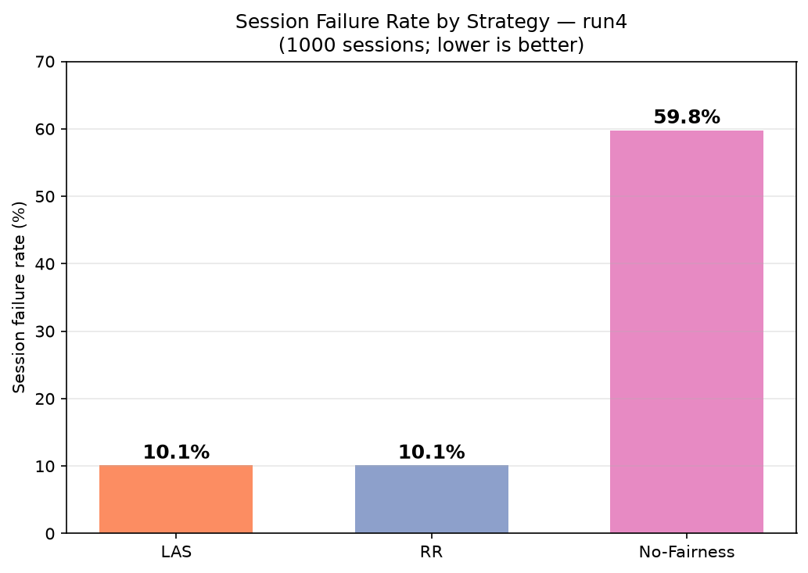
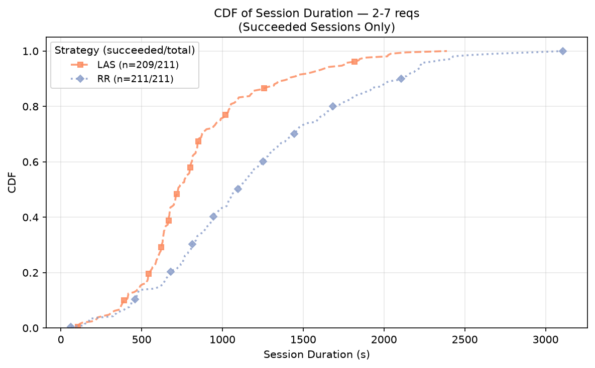
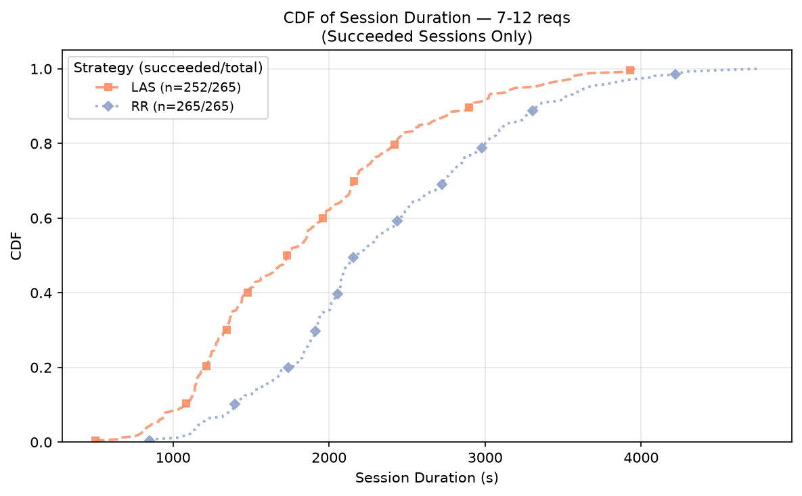
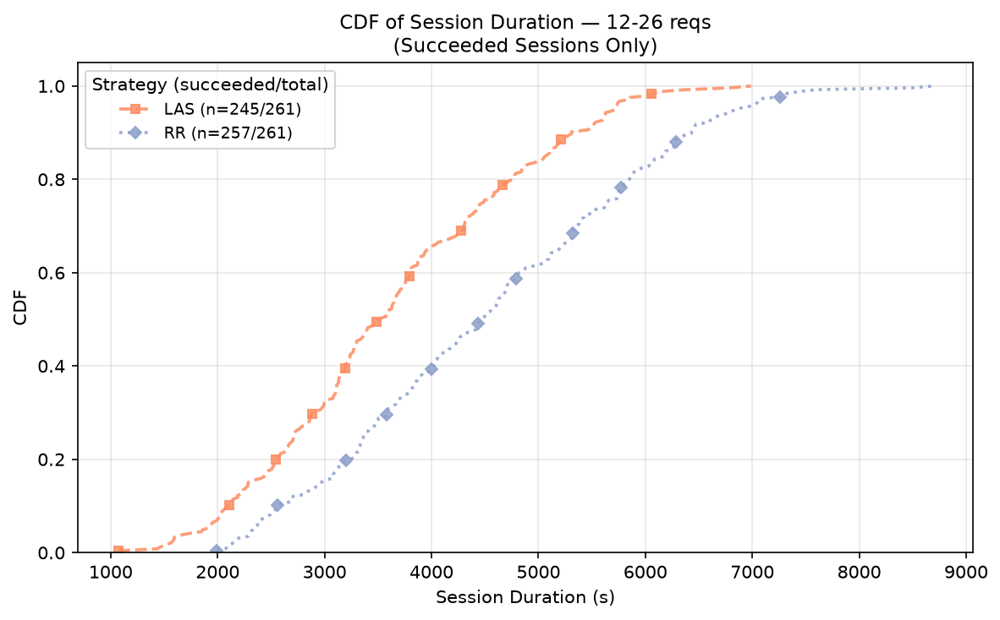
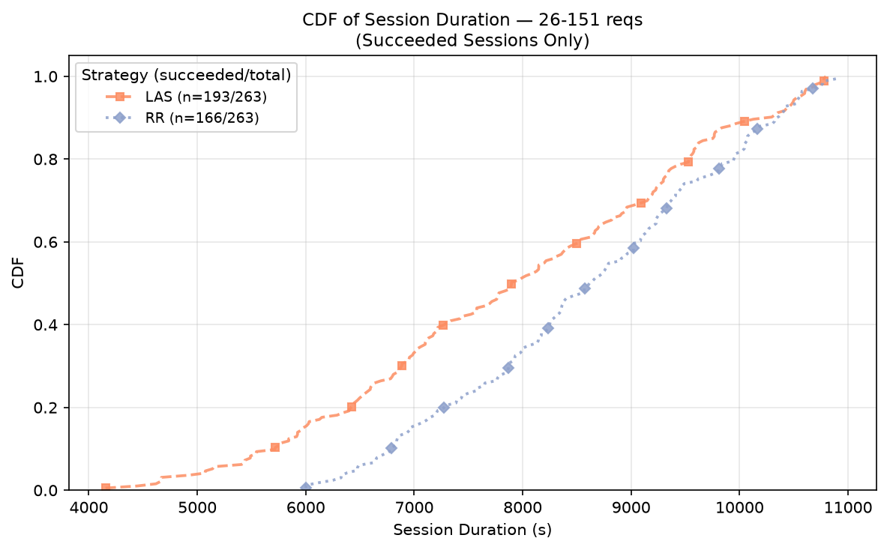

# Fairness Scheduling for Agentic Workloads — Qwen3.6-35B-A3B-FP8

Benchmarking session-level fairness in the llm-d-router (EPP) under a realistic
agentic-coding workload, replayed from real multi-turn traces. Compares three flow-control
strategies on the same model server and the same deterministic workload.

---

## Overview

Agentic coding clients (Claude Code, opencode, Codex) issue **many requests per session**, and
sessions are highly heterogeneous — some finish in 2 turns, others run 150+. Without fairness,
a few heavy sessions monopolize the model server and starve everyone else. This guide measures
how three scheduling strategies handle that contention:

- **LAS** (Least-Attained-Service) — program-aware fairness that prioritizes sessions which have
  received *less* cumulative service. The fairest to short/new sessions.
- **Round-Robin (RR)** — classic turn-based fairness across sessions.
- **No-Fairness** — baseline: pure scheduler scoring (queue / KV-cache / prefix-cache), no flow control.

Key aspects of the setup:

- **Per-session fairness via agent identity.** The EPP `agent-identity` plugin derives a
  `FairnessID` from the client's session header (`x-claude-code-session-id`), so each agent
  session gets its **own flow-control queue** — exactly as a real Claude Code / opencode deployment behaves.
- **Deterministic trace replay.** 1000 real agentic sessions (`Exgentic/agent-llm-traces`) are
  replayed with a fixed seed, so every strategy sees the identical 20,523-request workload.
- **Apples-to-apples.** Between strategies the orchestrator only swaps the EPP plugin config and
  flushes the model server (KV cache); model, hardware, and workload are held constant.

> 🚧 The EPP uses the released `ghcr.io/llm-d/llm-d-router-endpoint-picker:v0.9.0` image. The
> trace-replay load generator uses a development `inference-perf` image
> (`quay.io/pavanipenumalla/inference-perf:latest`) — pin it before any production use.

---

## Default Configuration

| Parameter | Value |
|-----------|-------|
| Model | `Qwen/Qwen3.6-35B-A3B-FP8` |
| Accelerator | NVIDIA H200 (2 GPUs/replica) |
| Serving topology | 2 decode replicas, tensor-parallel-size = 2 |
| Max context | 200,002 tokens |
| Max concurrent sequences | 64 |
| KV-cache dtype | FP8 |
| GPU memory utilization | 0.80 |
| EPP image | `ghcr.io/llm-d/llm-d-router-endpoint-picker:v0.9.0` |
| inference-perf image | `quay.io/pavanipenumalla/inference-perf:latest` |
| Workload | 600 concurrent / 1000 total sessions, 10 sessions/s, 20,523 requests |

### Supported Hardware Backends

| Backend | Directory | Notes |
|---------|-----------|-------|
| NVIDIA H100 GPU / vLLM | `model-server/` (mirrors `llm-d/guides/agentic-serving/modelserver/gpu/vllm/`) | TP=2, FP8 KV cache |

---

## Repository Layout

```
.
├── README.md                  ← you are here
├── .env.example               ← config template (copy to .env)
├── config.yml                 ← inference-perf workload (load shape, session header)
├── scrape_metrics.py          ← EPP metrics sidecar (scrapes during runs)
├── run.sh                     ← submit experiment to cluster (autonomous orchestrator)
├── download.sh                ← pull results from cluster + auto-generate plots
├── plots/
│   ├── analyze_reports.py     ← per-strategy latency/throughput plots
│   ├── compare_reports.py     ← cross-strategy program-duration comparison
│   ├── latency_comparison.py  ← TTFT / ITL / E2E comparison (CDFs, goodput-normalized)
│   └── throughput_latency.py  ← tokens/sec vs latency operating-point plot
└── model-server/              ← reference model-server config (applied from llm-d repo)
```

---

## Scheduling Strategies (EPP Configuration)

Each strategy is an `EndpointPickerConfig` applied to the EPP ConfigMap. All three share the same
scorers and the `agent-identity` plugin; they differ only in the flow-control fairness policy.

**LAS** — program-aware least-attained-service fairness:

```yaml
plugins:
- type: agent-identity            # derives FairnessID from x-claude-code-session-id
- type: queue-scorer
- type: kv-cache-utilization-scorer
- type: prefix-cache-scorer
- type: program-aware-fairness
featureGates:
- flowControl
flowControl:
  defaultPriorityBand:
    fairnessPolicyRef: program-aware-fairness
```

**Round-Robin** — replace the fairness plugin/ref with `round-robin-fairness-policy`.

**No-Fairness** — drop `agent-identity`, the fairness plugin, and the `flowControl` block entirely
(pure scheduler scoring).

> **agent-identity** reads provider session headers in priority order — `x-claude-code-session-id`
> (Claude Code), `x-session-affinity` (opencode), `session-id` (Codex) — and the Director uses the
> resolved value as the `FairnessID`. The workload sends its session id under
> `x-claude-code-session-id` (see `config.yml: api.session_id_header_key`), mirroring real Claude Code traffic.

---

## Prerequisites

```bash
export NAMESPACE=llm-d-program-aware
export GUIDE_NAME=agentic-serving          # Helm release; derives EPP svc name
export MODEL_DEPLOY=agentic-workloads-nvidia-gpu-vllm-decode

cp .env.example .env                        # then edit values to match the above
```

- OpenShift/Kubernetes cluster with H200 GPU nodes; `oc`/`kubectl` authenticated; `helm` v3+.
- Python 3.10+ with `matplotlib`, `numpy` (local plot generation; a `.venv` is included).
- Gateway API Inference Extension CRDs:

  ```bash
  kubectl apply -k "https://github.com/kubernetes-sigs/gateway-api-inference-extension/config/crd?ref=v1.5.0"
  ```
- HuggingFace token secret (model weights are gated):

  ```bash
  kubectl -n ${NAMESPACE} create secret generic hf-token --from-literal=token=${HF_TOKEN}
  ```

---

## Installation

### 1. Deploy the EPP (router) via Helm

```bash
cd /path/to/llm-d

# Pin the EPP to the released router image
cat > /tmp/epp-image.yaml << 'EOF'
inferenceExtension:
  image:
    registry: ghcr.io/llm-d
    repository: llm-d-router-endpoint-picker
    tag: v0.9.0
    pullPolicy: IfNotPresent
EOF

helm install ${GUIDE_NAME} \
    oci://registry.k8s.io/gateway-api-inference-extension/charts/standalone \
    -f guides/agentic-serving/router/agentic-workloads.values.yaml \
    -f /tmp/epp-image.yaml \
    -n ${NAMESPACE} --version v1.5.0
oc rollout status deployment/${GUIDE_NAME}-epp -n ${NAMESPACE}
```

The standalone chart's EPP Role grants `inferenceobjectives.llm-d.ai` (required) — without
list/watch on it the EPP crash-loops with *"failed waiting for InferenceObjective Informer to sync"*.

### 2. Deploy the model server

```bash
cd /path/to/llm-d
oc apply -n ${NAMESPACE} -k guides/agentic-serving/modelserver/gpu/vllm/
oc -n ${NAMESPACE} rollout status deployment/${MODEL_DEPLOY} --timeout=3600s
```

Model server flags (`model-server/patch-vllm.yaml`): `--seed=42 --tensor-parallel-size=2
--max-model-len=200002 --max-num-seqs=64 --kv-cache-dtype=fp8 --gpu-memory-utilization=0.8
--enable-auto-tool-choice --tool-call-parser=qwen3_coder --reasoning-parser=qwen3`.
DeepGEMM warmup takes ~10–15 min after scaling to 2 replicas.

### 3. Verify

```bash
oc port-forward svc/${GUIDE_NAME}-epp 8080:80 -n ${NAMESPACE} &
curl -s http://localhost:8080/v1/chat/completions -H 'Content-Type: application/json' \
  -d '{"model":"Qwen/Qwen3.6-35B-A3B-FP8","messages":[{"role":"user","content":"Hello"}],"max_tokens":20}' | jq
kill %1
```

---

## Workload

Defined in `config.yml` (`otel_trace_replay` + `trace_session_replay`):

| Parameter | Value | Meaning |
|-----------|-------|---------|
| `concurrent_sessions` | 600 | Max sessions in flight at once |
| `num_sessions` | 1000 | Total sessions replayed |
| `session_rate` | 10 | New sessions launched per second |
| `base_seed` | 42 | Deterministic → identical workload across strategies |
| `request_timeout` | 900 s | Per-request timeout |
| `session_id_header_key` | `x-claude-code-session-id` | Header carrying the per-session id |

Dataset: `Exgentic/agent-llm-traces` (real multi-turn agentic coding sessions). Session sizes range
2–151 requests; ~10% of the longest sessions hit the 200k context cap regardless of strategy.

---

## Running Experiments

The orchestrator runs **entirely on-cluster**: for each strategy it patches the EPP config,
flushes the model server (KV cache), launches the inference-perf job, and waits. You only need a
connection to submit and later download.

```bash
# Run all three strategies (las rr no-fairness), or a subset:
./run.sh run1                       # all three
./run.sh run1 "las"                 # single strategy
./run.sh run1 "rr no-fairness"      # subset

# Monitor:
oc -n ${NAMESPACE} logs job/orchestrator-run1 -f

# Download results + auto-generate comparison plots:
./download.sh run1
```

Results land in `run1/{las,rr,no-fairness}/reports/` plus `comparison/` and `comparison-matched/`.

### Verifying per-session fairness queues

With `agent-identity` active, the flow controller creates **one queue per session**. Confirm via
the EPP metrics endpoint while a run is dispatching:

```bash
oc port-forward -n ${NAMESPACE} deploy/${GUIDE_NAME}-epp 9090:9090 &
curl -s localhost:9090/metrics \
  | grep -c '^inference_extension_flow_control_queue_size{'   # ≈ concurrent_sessions
```

A healthy LAS/RR run shows ~600 distinct `fairness_id` queues (one per Claude session id);
No-Fairness shows none (flow control disabled).

---

## Results

Reproduced across five runs

### Session completion — the headline

Fairness is about **completing sessions**, not raw token throughput.

LAS and RR complete **~90%** of 1000 sessions; No-Fairness completes **~43%** — it lets a few heavy
sessions monopolize the server and abandons the rest (their requests are cancelled when a predecessor times out).



*run4 session failure rate — LAS 10.1%, RR 10.1%, No-Fairness 59.8%.*

### Program-duration CDFs by session size (LAS vs RR)

Session-duration CDFs (succeeded sessions), split by request-count bucket, comparing LAS vs RR at
**equal completion (899/899 sessions)**. LAS (orange) sits left of RR in every bucket — lower session
latency for the same amount of completed work. (No-Fairness is excluded from these CDFs: it completes
too few sessions, and only the easy ones, for a meaningful duration comparison.)

**Headline — median session duration, LAS vs RR (run4):**

| Session size | LAS p50 | RR p50 | LAS faster by |
|---|---|---|---|
| 2–7 reqs | 726 s | 1095 s | **34%** |
| 7–12 reqs | 1730 s | 2176 s | **21%** |
| 12–26 reqs | 3524 s | 4484 s | **21%** |
| 26–151 reqs | 7898 s | 8630 s | 9% |
| **All sizes** | **2432 s** | **2925 s** | **17%** |

LAS wins in every bucket. The edge is largest for short/mid sessions — least-attained-service
prioritizes sessions that have received less cumulative service — and is still ~9% even on the longest,
compute-bound sessions, all at identical completion.

| 2–7 requests | 7–12 requests |
|:---:|:---:|
|  |  |
| **12–26 requests** | **26–151 requests** |
|  |  |

### Latency (run4, per-request, **succeeded requests only**)

| Metric | LAS | RR | No-Fairness |
|---|---|---|---|
| TTFT p50 / p99 (s) | 145 / 530 | 229 / 618 | 190 / 645 |
| ITL p50 / p99 (ms) | 21 / 293 | 18 / 293 | 180 / **1198** |
| E2E p50 / p99 (s) | 175 / 552 | 237 / 583 | 101 / 599 |
| requests counted | 18,466 | 17,899 | **11,685** |

> ⚠️ **Read latency with completion %.** No-Fairness's *lower medians are survivorship bias* — it
> only finished 11,685 of ~18,000 requests (the easy ones), so its "fast" numbers are measured on an
> easier subset. Its honest cost shows in the **ITL p99 (1198 ms, ~4× LAS/RR)** and in completion.

### Goodput & completion-normalized view (run4)

| Strategy | events completed / 20,523 | completion |
|---|---|---|
| LAS | 18,419 | **89.7%** |
| RR | 17,814 | 86.8% |
| No-Fairness | 11,685 | **56.9%** |

The fair way to compare latency is normalized over **all intended requests**: each strategy's CDF
rises only to its completion ceiling, and the gap to 1.0 is abandoned work. See
`plots/latency_comparison.py` → `*_cdf_allreqs.png` (No-Fairness plateaus at ~0.57; LAS reaches ~0.90, RR ~0.87).

### Takeaways

- **LAS ≈ RR on completion (~90%)**; LAS has slightly lower median program duration, RR a slightly
  tighter latency tail. Both vastly outperform No-Fairness on completed work.
- **No-Fairness maximizes raw token throughput by sacrificing fairness** — it abandons >half the
  sessions and blows out the inter-token tail. Its apparent latency win is a measurement artifact.
- **The correct top-line metrics are completion % and goodput**, with latency always reported
  alongside how much work finished.

---

## Analysis Scripts

```bash
# Cross-strategy program-duration comparison (CDFs by request-count bucket + percentile table)
.venv/bin/python plots/compare_reports.py --las run1/las/reports --rr run1/rr/reports \
    --no-fairness run1/no-fairness/reports -o run1/comparison/

# TTFT / ITL / E2E comparison (log-scale CDFs, completion-normalized CDFs, goodput table)
.venv/bin/python plots/latency_comparison.py --las run1/las/reports --rr run1/rr/reports \
    --no-fairness run1/no-fairness/reports -o run1/latency-comparison/

# Tokens/sec vs latency operating-point plot (annotated with completion %)
.venv/bin/python plots/throughput_latency.py --las run1/las/reports --rr run1/rr/reports \
    --no-fairness run1/no-fairness/reports -o run1/latency-comparison/
```

---

## Cleanup

```bash
oc -n ${NAMESPACE} delete job -l app=inference-perf
oc -n ${NAMESPACE} delete job -l app=fairness-orchestrator
oc -n ${NAMESPACE} delete pvc -l app=inference-perf   # or: inference-perf-results-<run>
helm uninstall ${GUIDE_NAME} -n ${NAMESPACE}
oc delete -n ${NAMESPACE} -k /path/to/llm-d/guides/agentic-serving/modelserver/gpu/vllm/
```
</content>
